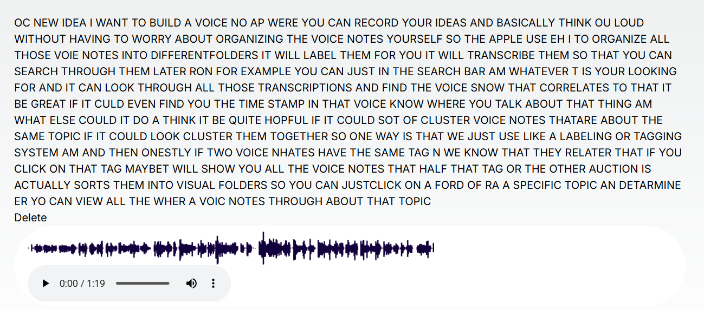
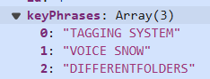
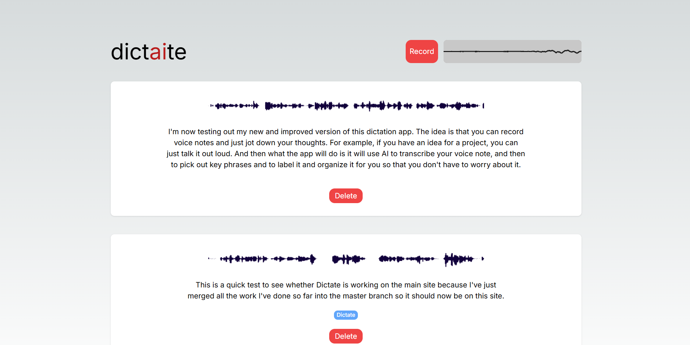

# Project Report

## Brief

Build a voice note app for quickly verbalising ideas and thinking out loud.

The idea is was that using AI, these voice notes can be transcribed, summarised, labelled and sorted into a helpful folder system.

So that it is easy to recover these thoughts again later on.


## Challenges

### 1. Accuracy of transcriptions

Initially I was transcribing audio recordings using the Wav2Vec model on hugging face.

If you were very articulate with your speaking, you could get reasonably acceptable transcriptions from this. However the model struggled with technical terms (e.g. MP3 being transcribed as "EMPY THREE"), and it did not seem able to deduce what a word was from the context of the sentence. Furthermore, it did not make any attempts to guess at what the punctation should be.


### 2. Difficulty hosting LLMs

For this project, . Most of these LLMs were too large, and were hitting the limits imposed by the low level tiers on Heroku and Vercel.


### 3. Slow start up time on serverless infrastructures


### Tools and skills learned

- Using **OpenAI** models (used the Whisper speech-to-text model for transcribing recordings)
- Using pre-trained models on hugging face library


My vision is that this will eventually be a mobile app, but for now I've decided to build the app in the web browser making use of the browser-based storage APIs (namely, indexDB) to avoid having to host audio files in the cloud.


Here is a screenshot of an early version of the application:



And here are the tags / keyphrases it picked out:



So as you can see, it's _sort of_ working, but there are a lot of mistakes.

**Transcription:**

> OC NEW IDEA I WANT TO BUILD A VOICE NO AP WERE YOU CAN RECORD YOUR IDEAS AND BASICALLY THINK OU LOUD WITHOUT HAVING TO WORRY ABOUT ORGANIZING THE VOICE NOTES YOURSELF SO THE APPLE USE EH I TO ORGANIZE ALL THOSE VOIE NOTES INTO DIFFERENTFOLDERS IT WILL LABEL THEM FOR YOU IT WILL TRANSCRIBE THEM SO THAT YOU CAN SEARCH THROUGH THEM LATER RON FOR EXAMPLE YOU CAN JUST IN THE SEARCH BAR AM WHATEVER T IS YOUR LOOKING FOR AND IT CAN LOOK THROUGH ALL THOSE TRANSCRIPTIONS AND FIND THE VOICE SNOW THAT CORRELATES TO THAT IT BE GREAT IF IT CULD EVEN FIND YOU THE TIME STAMP IN THAT VOICE KNOW WHERE YOU TALK ABOUT THAT THING AM WHAT ELSE COULD IT DO A THINK IT BE QUITE HOPFUL IF IT COULD SOT OF CLUSTER VOICE NOTES THATARE ABOUT THE SAME TOPIC IF IT COULD LOOK CLUSTER THEM TOGETHER SO ONE WAY IS THAT WE JUST USE LIKE A LABELING OR TAGGING SYSTEM AM AND THEN ONESTLY IF TWO VOICE NHATES HAVE THE SAME TAG N WE KNOW THAT THEY RELATER THAT IF YOU CLICK ON THAT TAG MAYBET WILL SHOW YOU ALL THE VOICE NOTES THAT HALF THAT TAG OR THE OTHER AUCTION IS ACTUALLY SORTS THEM INTO VISUAL FOLDERS SO YOU CAN JUSTCLICK ON A FORD OF RA A SPECIFIC TOPIC AN DETARMINE ER YO CAN VIEW ALL THE WHER A VOIC NOTES THROUGH ABOUT THAT TOPIC


**Here is what I actually said:**

> Okay, new idea - I want to build a voice note app where you can record your ideas and basically think out loud without having to worry about organising the voice notes yourself. So the app will use AI to organise all those voice notes into different folders. It will label them for you, it will transcribe them so that you can search through them later on - for example, you can just put in the search bar, um, whatever it is you're looking for and it can look through all those transcriptions and find the voice note that correlates to that. It'd be great if it could even find you the timestamp in that voice note where you talk about that thing. Um, what else could it do? I think it'd be quite helpful if it could sort of cluster voice notes that are about the same topic. If it could like cluster them together, so one way is that we just use like a labelling or tagging system um and then obviously if two voice notes have the same tag, then we know that they are related. And if you click on that tag, maybe it will show you all the voice notes that have that tag. Or the other option is it actually sorts them into visual folders, so you can just click on a folder for a specific topic and determine uh you can view all the voice notes that are about that topic.


**OpenAI Whisper model's transcription:**

> Okay, new idea. I want to build a voice note app where you can record your ideas and basically think out loud without having to worry about organizing the voice notes yourself. So the app will use AI to organize all those voice notes into different folders, it will label them for you, it will transcribe them so that you can search through them later on for example, you can just put in the search bar whatever it is you're looking for and it can look through all those transcriptions and find the voice note that correlates to that. It'd be great if it could even find you the timestamp in that voice note where you talk about that thing. What else could it do? I think it'd be quite helpful if it could sort of cluster voice notes that are about the same topic, if it could like cluster them together. So one way is that we just use like a labeling or tagging system and then obviously if two voice notes have the same tag we know that they're related and if you click on that tag maybe it will show you all the voice notes that have that tag. Or the other option is it actually sorts them into visual folders so you can just click on a folder for a specific topic and determine, you know you can view all the voice notes that are about that topic.


**Verbose JSON transcription:**

```json
{
  task: 'transcribe',
  language: 'english',
  duration: 79.80000305175781,
  text: "Okay, new idea. I want to build a voice note app where you can record your ideas and basically think out loud without having to worry about organizing the voice notes yourself. So the app will use AI to organize all those voice notes into different folders, it will label them for you, it will transcribe them so that you can search through them later on for example, you can just put in the search bar whatever it is you're looking for and it can look through all those transcriptions and find the voice note that correlates to that. It'd be great if it could even find you the timestamp in that voice note where you talk about that thing. What else could it do? I think it'd be quite helpful if it could sort of cluster voice notes that are about the same topic, if it could like cluster them together. So one way is that we just use like a labeling or tagging system and then obviously if two voice notes have the same tag we know that they're related and if you click on that tag maybe it will show you all the voice notes that have that tag. Or the other option is it actually sorts them into visual folders so you can just click on a folder for a specific topic and determine, you know you can view all the voice notes that are about that topic.",
  segments: [
    {
      id: 0,
      seek: 0,
      start: 0,
      end: 3.2799999713897705,
      text: ' Okay, new idea.',
      tokens: [Array],
      temperature: 0,
      avg_logprob: -0.26797497272491455,
      compression_ratio: 1.6714285612106323,
      no_speech_prob: 0.13284489512443542
    },
    {
      id: 1,
      seek: 0,
      start: 3.2799999713897705,
      end: 8.800000190734863,
      text: ' I want to build a voice note app where you can record your ideas and basically think',
      tokens: [Array],
      temperature: 0,
      avg_logprob: -0.26797497272491455,
      compression_ratio: 1.6714285612106323,
      no_speech_prob: 0.13284489512443542
    },
    {
      id: 2,
      seek: 0,
      start: 8.800000190734863,
      end: 15.5600004196167,
      text: ' out loud without having to worry about organizing the voice notes yourself.',
      tokens: [Array],
      temperature: 0,
      avg_logprob: -0.26797497272491455,
      compression_ratio: 1.6714285612106323,
      no_speech_prob: 0.13284489512443542
    },
    {
      id: 3,
      seek: 0,
      start: 15.5600004196167,
      end: 20.799999237060547,
      text: ' So the app will use AI to organize all those voice notes into different folders, it will',
      tokens: [Array],
      temperature: 0,
      avg_logprob: -0.26797497272491455,
      compression_ratio: 1.6714285612106323,
      no_speech_prob: 0.13284489512443542
    },
    {
      id: 4,
      seek: 0,
      start: 20.799999237060547,
      end: 26,
      text: ' label them for you, it will transcribe them so that you can search through them later',
      tokens: [Array],
      temperature: 0,
      avg_logprob: -0.26797497272491455,
      compression_ratio: 1.6714285612106323,
      no_speech_prob: 0.13284489512443542
    },
    {
      id: 5,
      seek: 2600,
      start: 26,
      end: 31.040000915527344,
      text: " on for example, you can just put in the search bar whatever it is you're looking for and",
      tokens: [Array],
      temperature: 0,
      avg_logprob: -0.2607172131538391,
      compression_ratio: 1.765625,
      no_speech_prob: 0.6888427734375
    },
    {
      id: 6,
      seek: 2600,
      start: 31.040000915527344,
      end: 36.36000061035156,
      text: ' it can look through all those transcriptions and find the voice note that correlates to',
      tokens: [Array],
      temperature: 0,
      avg_logprob: -0.2607172131538391,
      compression_ratio: 1.765625,
      no_speech_prob: 0.6888427734375
    },
    {
      id: 7,
      seek: 2600,
      start: 36.36000061035156,
      end: 37.36000061035156,
      text: ' that.',
      tokens: [Array],
      temperature: 0,
      avg_logprob: -0.2607172131538391,
      compression_ratio: 1.765625,
      no_speech_prob: 0.6888427734375
    },
    {
      id: 8,
      seek: 2600,
      start: 37.36000061035156,
      end: 40.36000061035156,
      text: " It'd be great if it could even find you the timestamp in that voice note where you talk",
      tokens: [Array],
      temperature: 0,
      avg_logprob: -0.2607172131538391,
      compression_ratio: 1.765625,
      no_speech_prob: 0.6888427734375
    },
    {
      id: 9,
      seek: 2600,
      start: 40.36000061035156,
      end: 43.20000076293945,
      text: ' about that thing.',
      tokens: [Array],
      temperature: 0,
      avg_logprob: -0.2607172131538391,
      compression_ratio: 1.765625,
      no_speech_prob: 0.6888427734375
    },
    {
      id: 10,
      seek: 2600,
      start: 43.20000076293945,
      end: 44.20000076293945,
      text: ' What else could it do?',
      tokens: [Array],
      temperature: 0,
      avg_logprob: -0.2607172131538391,
      compression_ratio: 1.765625,
      no_speech_prob: 0.6888427734375
    },
    {
      id: 11,
      seek: 2600,
      start: 44.20000076293945,
      end: 49.119998931884766,
      text: " I think it'd be quite helpful if it could sort of cluster voice notes that are about",
      tokens: [Array],
      temperature: 0,
      avg_logprob: -0.2607172131538391,
      compression_ratio: 1.765625,
      no_speech_prob: 0.6888427734375
    },
    {
      id: 12,
      seek: 2600,
      start: 49.119998931884766,
      end: 52.36000061035156,
      text: ' the same topic, if it could like cluster them together.',
      tokens: [Array],
      temperature: 0,
      avg_logprob: -0.2607172131538391,
      compression_ratio: 1.765625,
      no_speech_prob: 0.6888427734375
    },
    {
      id: 13,
      seek: 5236,
      start: 52.36000061035156,
      end: 58.2400016784668,
      text: ' So one way is that we just use like a labeling or tagging system and then obviously if two',
      tokens: [Array],
      temperature: 0,
      avg_logprob: -0.31418392062187195,
      compression_ratio: 1.813008189201355,
      no_speech_prob: 0.014949396252632141
    },
    {
      id: 14,
      seek: 5236,
      start: 58.2400016784668,
      end: 62.52000045776367,
      text: " voice notes have the same tag we know that they're related and if you click on that tag",
      tokens: [Array],
      temperature: 0,
      avg_logprob: -0.31418392062187195,
      compression_ratio: 1.813008189201355,
      no_speech_prob: 0.014949396252632141
    },
    {
      id: 15,
      seek: 5236,
      start: 62.52000045776367,
      end: 65.72000122070312,
      text: ' maybe it will show you all the voice notes that have that tag.',
      tokens: [Array],
      temperature: 0,
      avg_logprob: -0.31418392062187195,
      compression_ratio: 1.813008189201355,
      no_speech_prob: 0.014949396252632141
    },
    {
      id: 16,
      seek: 5236,
      start: 65.72000122070312,
      end: 70.63999938964844,
      text: ' Or the other option is it actually sorts them into visual folders so you can just click',
      tokens: [Array],
      temperature: 0,
      avg_logprob: -0.31418392062187195,
      compression_ratio: 1.813008189201355,
      no_speech_prob: 0.014949396252632141
    },
    {
      id: 17,
      seek: 5236,
      start: 70.63999938964844,
      end: 78.19999694824219,
      text: ' on a folder for a specific topic and determine, you know you can view all the voice notes',
      tokens: [Array],
      temperature: 0,
      avg_logprob: -0.31418392062187195,
      compression_ratio: 1.813008189201355,
      no_speech_prob: 0.014949396252632141
    },
    {
      id: 18,
      seek: 5236,
      start: 78.19999694824219,
      end: 79.76000213623047,
      text: ' that are about that topic.',
      tokens: [Array],
      temperature: 0,
      avg_logprob: -0.31418392062187195,
      compression_ratio: 1.813008189201355,
      no_speech_prob: 0.014949396252632141
    }
  ]
}
```

### After some design changes

